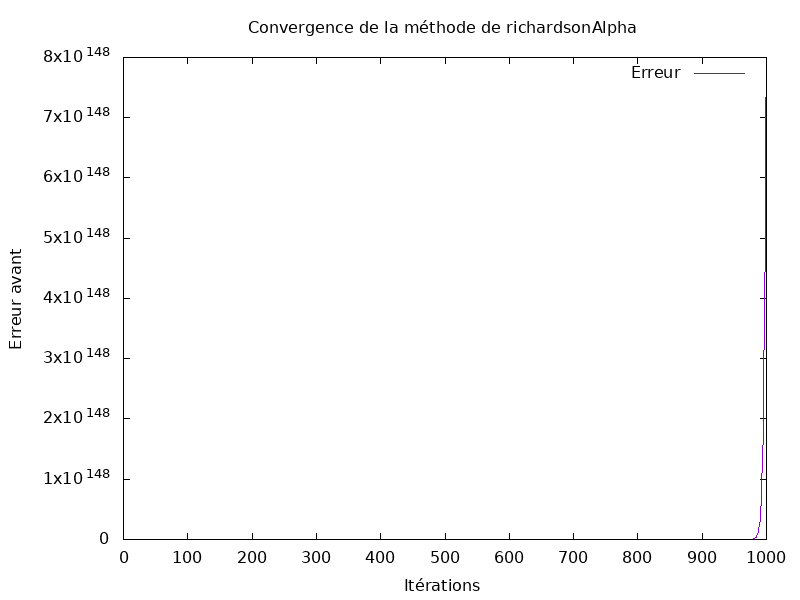
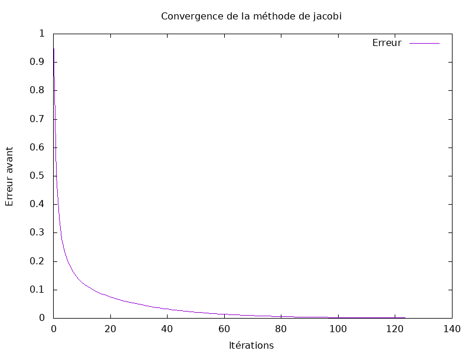
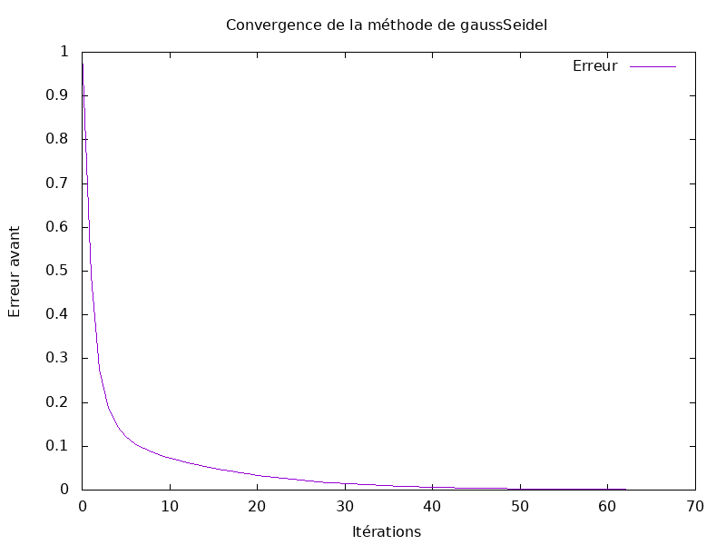

# Compte rendu du TP Poisson

## Introduction

Le but de ce TD/TP était de voir puis appliquer différents algorithmes pour résoudre un système linéaire issu de la discrétisation, par la méthode des différences finies, de l'équation de la chaleur 1D stationnaire. Les implémentations sont réalisées en C avec BLAS et LAPACK.

# Travail préliminaire

Nous avons effectué, avant toute implémentation en C, un travail préliminaire d'explications et de compréhension de l'équation de la chaleur.

Dans le cas où le terme source est nul $(𝑔=0)$, la solution analytique de l'équation est donnée par :
$$ 𝑇(𝑥)= 𝑇_0 + 𝑥(𝑇_1 − 𝑇_0) $$

## Exercice 1 

### Question 1


## Exercice 2

L'exercice 2, portant uniquement sur l'installation de BLAS/LAPACK ainsi que la création du git et du makefile, nous ne nous attarderons pas dessus.

# Méthode directe et stockage bande

## Exercice 3

### Question 1
Pour utiliser `BLAS` et `LAPACK`, nous devons déclarer et allouer les matrices sous forme d'**un tableau 1D contigu** (étant considéré comme un 2D).
Nous utiliserons pour cela `LAPACK_ROW_MAJOR` en C pour déclarer les tableaus en `Ligne-Major`.

Exemple:
```c++
double* A = (double*)malloc(m * n * sizeof(double));
```

### Question 2

La constante `LAPACK_COL_MAJOR` fait référence à **l'ordre de stockage en mémoire**.
Ici les matrices seront stockées en `Colonne-Major` c'est-à-dire que les éléments sont stockés colonne par colonne. 
Le rangement en colonne-Major est plutôt utile pour d'autre langages (comme FORTRAN) car la C est lui en `Ligne-Major`.

### Question 3

La dimension principale (`ld`, ou `lda` pour leading dimension of A) permet d'indiquer comment une matrice est stockée en mémoire.
Elle permet d'indiquer le **nombre d'éléments entre chaque ligne** (en colonne-major) ou chaque colonne (en ligne-major).

### Question 4

La fonction `dgbmv` est une fonction de la bibliothèque `LAPACK` qui permet d'effectuer **une multiplication matrice-vecteur** pour une matrice bande.  

### Question 5

La fonction `dgbtrf` appartient également à la biliothèque LAPACK et effectue la **factorisation LU** d'une matrice bande avec **pivotement partiel**.

### Question 6

La fonction `dgbtrs` vient de LAPACK et **résout un système d'équation linéaires** en utilisant la factorisation LU d'une matrice bande préalablement calculée par `dgbtrf`.
Cette fonction est optimale pour les matrices bandes car elle utilise leur structure particulière pour limiter les calculs.

### Question 7

La fonction `dgbsv` effectue à **la fois la factorisation LU et la résolution d'un système linéaire**.
Elle permet de combiner en une fonction `dgbtrf` et `dgbtrs` et est de fait très optimisée et utilisable pour les matirices bandes.

### Question 8

Soit R le résidu : $R = b - A\^x$

L'erreur arrière est : 
$$\frac{||b - A\^x||}{||A||||\^x||}$$

L'erreur avant est : 
$$\frac{||k||}{||b||} = \frac{||b - A\^x||}{||b||} = \frac{||x - \^x||}{||x||}$$

Pour calculer la norme du vecteur : $n = sqrt(ddot(\&n, x, 1, x, 1))$

Pour calculer $||x - \^x||$ : $daxpy(\&n, x, 1, x, 1) = \^x-x = x$

et $nx = norme(x)$ avec $res = n / nx$

## Exercice 4

Lors de ce TP, nous avons choisi d'utiliser le stockage bande pour les matrices que nous allons utiliser. L'avantage du stockage bande est qu'il est utilisable sur BLAS/LAPACK et qu'il prend moins de place en mémoire qu'une matrice complète.

Étant donné que nous avons des matrices tridiagonales, il est donc beaucoup plus optimisé d'opter pour ce type de stockage de matrices.

Afin de valider les valeurs obtenues dans la matrice, il faut multiplier un **vecteur unitaire avec AB** avec la méthode `dgbmv`. Il faut ensuite vérifier que le résultat correspond à un **vecteur nul avec un 1 à chaque extrémités**.

## Exercice 5

Les performances de `dgbsv` sont égales aux performances de `dgbtrs` lorsque nous mesurons les temps d'exécutions. 

Cela semble logique étant donné que `dgbsv` utilise dans son fonctionnement `dgbtrs` et `dgbtrf`, leur complexité est donc similaire car un final l'appel à la résolution du système linéaire se fait sur les mêmes fonctions de BLAS.

## Exercice 6

L'implémentation de la factorisation LU pour les matrices tridiagonales stockées en matrices bandes a été effectué comme suit :

```c
int dgbtrftridiag(int *la, int*n, int *kl, int *ku, double *AB, int *lab, int *ipiv, int *info){
  double factor; 
  *info = 0;    
  if (*kl != 1 || *ku != 1) {
    printf("Erreur : La largeur des bandes doit être 1 pour une matrice tridiagonale.\n");
    *info = -1;
    return -1; 
  }
  for (int i = 0; i < *n - 1; i++) {
    if (AB[1 + i * (*lab)] == 0.0) { 
      *info = i + 1; 
      return -1;
    }
    factor = AB[0 + (i + 1) * (*lab)] / AB[1 + i * (*lab)];
    AB[0 + (i + 1) * (*lab)] = factor; 
    AB[1 + (i + 1) * (*lab)] -= factor * AB[2 + i * (*lab)];
  }
  for (int i = 0; i < *n; i++) {
    ipiv[i] = i + 1; 
  }
  return 0; 
}
```

### Analyse de complexité

La fonction `dgbtrftridiag` obtient une complexité de O(n) grâce au fait qu'elle utilise des matices bandes et donc qu'il n'y a qu'une boucle for au maximum. 

La complexité en esapce est également très bonne car les matrices bandes n'ont que peu de valeurs nulle; et donc inutiles.

### Vérification des valeurs

Afin de vérifier si notre calcul est correct, il faut commencer par calculer `l'erreur relative`.
Si cette erreur est inférieure à la limite que nous nous sommes imposé *(par exemple $>10^{-10})$)*, nous pouvons considérer que les calculs sont corrects.

On peut également valider l'implémentation de `dgbtrftridiag` en multipliant la matrice L et U obtenues après l'appel à la fonction. On vérifiera alors que le résultat est bien la matrice originale.

# Méthode de résolution Itérative

## Exercice 7



### Convergence

La convergence de l'algorithme de Richardson avec matrices bandes est correcte dès la vingtaine d'itérations mais converge cependant assez lentement en comparaison d'autres méthodes présentées par la suite.

Cette méthode obtient une convergence de 10<sup>-3</sup> en 125 itérations.

## Exercice 8



### Convergence

La méthode de Jacobi est l'une des plus simple à implémenter. Elle permet une convergence correcte par rapport à sa complexité mais qui est cependant largement dépasée par Gauss-Seidel.

On peut ici observer une convergence satisfaisante au bout de la vingtaine d'itérations avant d'avoir une convergence lente par la suite.

Cette méthode obtient également une convergence de 10<sup>-3</sup> en 125 itérations.

## Exercice 9



### Convergence

Gauss-Seidel reste la meilleure implémentation faite en terme de convergence en étant ~2 fois plus rapide que les autres ne nécessitant qu'une dizaine d'itérations avant d'obtenir une convergence convenable.

Cette dernière méthode obtient une convergence de 10<sup>-3</sup> en 63 itérations.